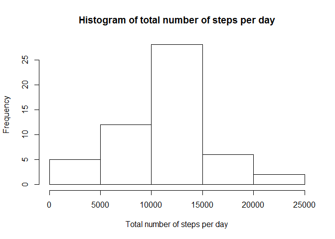
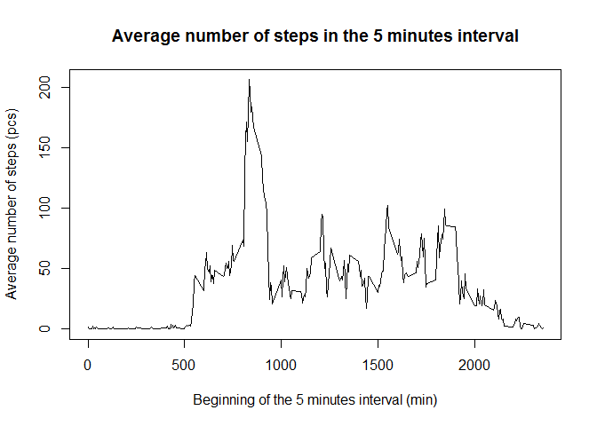
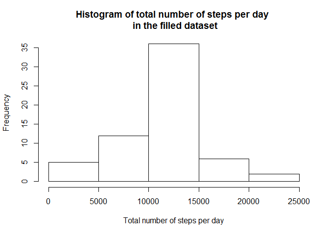
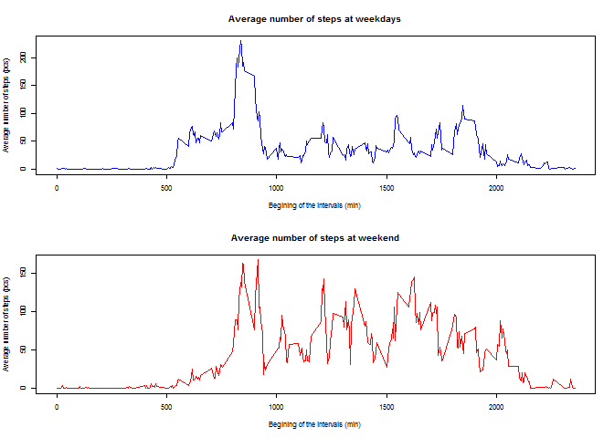

# Reproducible Research: Peer Assessment 1
Henrik Bata  
2015. november 8.  


## Loading and preprocessing the data
### Loading the data
#### Option 1 : From downloaded zip file
1. Set YOUR working directory. You can see mine below.

```r
setwd("C:\\Users\\Henrik\\Dropbox\\Coursera\\Reproducible Research\\Peer Assessment 1\\RepData_PeerAssessment1")
```

2. Give the name of the zip file.

```r
zip_file <- "activity.zip"
```
3. Extract the list of the files from the zip file.

```r
zipFileInfo <- unzip(zip_file, list=TRUE)
```

4. Unzip it and load it to the *rawdata* variable. We can do it here easily because zip contains only one element.

```r
rawdata <- read.csv(unz(zip_file, as.character(zipFileInfo$Name)), stringsAsFactors = FALSE)
```


#### Option 2 : Load the data directly from the web

1. Create a temporary file.

```r
temp <- tempfile()
```

2. Give the URL of the zip and use *download.file()* to fetch the file into the temporary file.

```r
URL <- "https://d396qusza40orc.cloudfront.net/repdata%2Fdata%2Factivity.zip"
download.file(URL, temp)
```

3. Extract the list of the files from the zip file.

```r
zipFileInfo <- unzip(temp, list=TRUE)
```

4. Unzip it and load it to the *rawdata* variable. We can do it easily because out zip contains only one element.

```r
rawdata <- read.csv(unz(temp, as.character(zipFileInfo$Name)), stringsAsFactors = FALSE)
```

5. Remove the temporary file.

```r
unlink(temp)
```

### Preprocessing the data
#### Preprocessing the *date* variable
With the usage of *lubridate* package you can easily handle and convert the time type variable. The *date* attribute is character and we convert it to "POSIXct". This is a time variable time.

```r
require("lubridate")
```

```
## Loading required package: lubridate
```

```r
class(rawdata$date)
```

```
## [1] "character"
```

```r
processed_data <- rawdata

processed_data$date <- ymd(rawdata$date)
class(processed_data$date)
```

```
## [1] "POSIXct" "POSIXt"
```


## What is mean total number of steps taken per day?
0. Ignore the missing values from the data

```r
complete_data <- processed_data[complete.cases(processed_data), ]
```

1. Calculate the total number of steps taken per day.

```r
total_steps <- aggregate(steps ~ date, complete_data, sum)
```

2. Make a histogram of the total number of steps taken each day

```r
hist(total_steps$steps, 
     xlab = "Total number of steps per day", 
     main = "Histogram of total number of steps per day")
```

 

3. Calculate and report the mean and median of the total number of steps taken per day

```r
mean(total_steps$steps)
```

```
## [1] 10766.19
```

```r
median(total_steps$steps)
```

```
## [1] 10765
```


## What is the average daily activity pattern?
1. Make a time series plot (i.e. type = "l") of the 5-minute interval (x-axis) and the average number of steps taken, averaged across all days (y-axis)
 

```r
average_number_of_steps_in_intervals <- aggregate(steps ~ interval, processed_data, mean)
plot(average_number_of_steps_in_intervals$interval,
     average_number_of_steps_in_intervals$steps,
     xlab = "Beginning of the 5 minutes interval (min)",
     ylab = "Average number of steps (pcs)",
     type = "l",
     main = "Average number of steps in the 5 minutes interval")
```

 
 
2. Which 5-minute interval, on average across all the days in the dataset, contains the maximum number of steps? 


```r
max_step <- max(average_number_of_steps_in_intervals$steps)
average_number_of_steps_in_intervals$interval[average_number_of_steps_in_intervals$steps == max_step]
```

```
## [1] 835
```


## Imputing missing values
1. Calculate and report the total number of missing values in the dataset (i.e. the total number of rows with NAs)

```r
sum(!complete.cases(rawdata))
```

```
## [1] 2304
```

2. Filling in all of the missing values in the dataset. The strategy is to use the mean the 5-minute interval. Create a new dataset that is equal to the original dataset but with the missing data filled in. 


```r
filled_data <- processed_data
for (i in 1:nrow(filled_data)){
  if (is.na(filled_data$steps[i])){
    act_interval <- filled_data$interval[i]
    avg_step <- average_number_of_steps_in_intervals$steps[average_number_of_steps_in_intervals$interval == act_interval]
    filled_data$steps[i] <- avg_step
  }
}
```

3. Make a histogram of the total number of steps taken each day and Calculate and report the mean and median total number of steps taken per day.


```r
total_number_of_steps_filled <- aggregate(steps ~ date, filled_data, sum)

hist(total_number_of_steps_filled$steps, 
     xlab = "Total number of steps per day", 
     main = "Histogram of total number of steps per day \n in the filled dataset")
```

 

```r
mean(total_number_of_steps_filled$steps)
```

```
## [1] 10766.19
```

```r
median(total_number_of_steps_filled$steps)
```

```
## [1] 10766.19
```

4. Do these values differ from the estimates from the first part of the assignment? What is the impact of imputing missing data on the estimates of the total daily number of steps?

```r
mean(total_number_of_steps_filled$steps) - mean(total_steps$steps)
```

```
## [1] 0
```

```r
median(total_number_of_steps_filled$steps) - median(total_steps$steps)
```

```
## [1] 1.188679
```

Because I used the mean to replace the missing value the mean doesn't changed at all. The median changed but not largely. 


## Are there differences in activity patterns between weekdays and weekends?
1. Split the *filled_data* to weekend and week days data set.

```r
weekdays_data <- filled_data[!(wday(filled_data$date) == 1 | wday(filled_data$date) == 7), ] 
weekend_data <- filled_data[wday(filled_data$date) == 1 | wday(filled_data$date) == 7, ]   
```

2. Calculate the mean of the steps in the different intervals. (Like **What is the average daily activity pattern?** in pharagraph.)

```r
avg_weekdays <- aggregate(steps ~ interval, weekdays_data, mean)
avg_weekend <- aggregate(steps ~ interval, weekend_data, mean)
```

3. Create a plot which can answer the question.

```r
par(mfrow = c(2 , 1))
par(cex = 0.5)

plot(avg_weekdays$interval,
     avg_weekdays$steps,
     main = "Average number of steps at weekdays",
     xlab = "Begining of the intervals (min)",
     ylab = "Average number of steps (pcs)",
     type = "l",
     col = "blue")


plot(avg_weekend$interval,
     avg_weekend$steps,
     main = "Average number of steps at weekend",
     xlab = "Begining of the intervals (min)",
     ylab = "Average number of steps (pcs)",
     type = "l",
     col = "red")
```

 

4. Conclusion
Yes, there is difference between the average number of the steps at the weekdays and at the weekend. In both case there are a peak between 750 - 1000 minute. But at weekend after the 1000 minute the observed people are much more active than at weekdays.  
